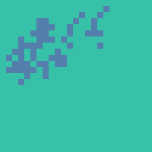
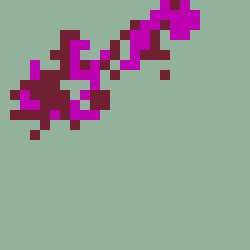

MATH 214 Capstone Project
===========================
Spectral Clustering and K-Means Clustering

By Umair Ahmed <aumair@umich.edu>

# Quick start

```console
$ make spectral_clustering.exe
$ ./spectral_clustering.exe IN_FILENAME NUM_CLUSTERS [--debug]
```

# Inputs

The program reads in a .ppm file in the P3 format. The .ppm file should not have any comments and it should have a range of 255. These image files can be opened in Adobe Photoshop without any additional plugins.

# Outputs

### Without Debug Flag
If there is no debug flag, the program produces one output: the pixel clusters with a randomly generated color palette in output.ppm. 

### With Debug Flag
If the debug flag is passed in, the program produces output.ppm as well as the compressed image compressed.ppm. This compressed image is the image that is read and processed when an image has greater than 625 pixels. The program also will print out the eigenvalues and eigenvectors for the normalized Laplacian. Note: this  information will likely be useless when the image is large, as there will be an eigenvalue and eigenvector for each pixel in the image/compressed image.

# Examples
### Simple image

 *Simple example image*

`./spectral_clustering.exe Resources/largeimage.ppm 3`

 *Example image split into 3 clusters*

### Large, more complex image

 *Image of Snail from PPMA*

 *Image of Snail Post-Compression*

`./spectral_clustering.exe Resources/snail.ascii.ppm 2`


*Snail split into 2 clusters*

`./spectral_clustering.exe Resources/snail.ascii.ppm 3`


*Snail split into 3 clusters*

# Credits

This project heavily uses the Eigen library for matrix multiplication and eigenvalue/eigenvector calculation. 

blackbuck.ascii.ppm and snail.ascii.ppm are sourced from PPMA at <https://people.sc.fsu.edu/~jburkardt/data/ppma/ppma.html> and were only used for testing/demonstration purposes. Umair Ahmed does not claim ownership of these images nor does he intend to profit off of them.